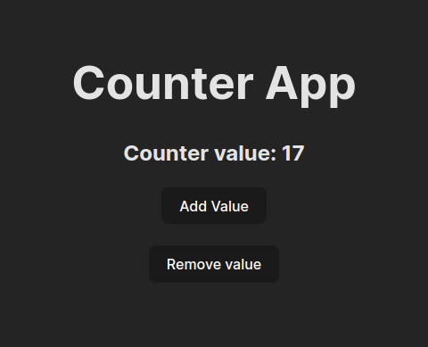
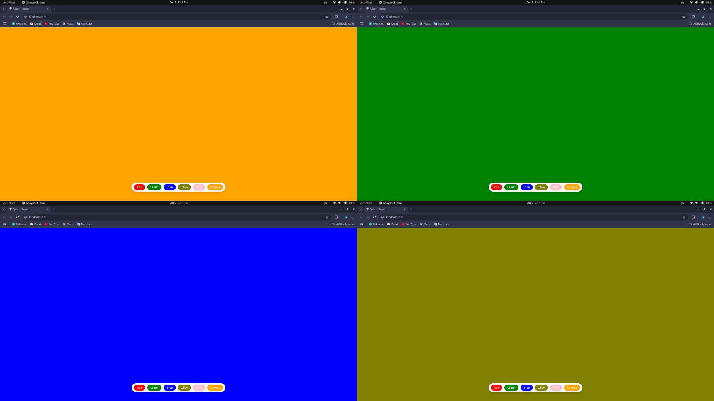
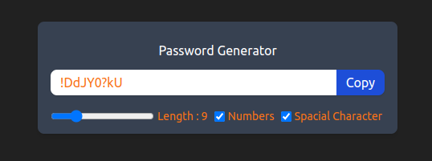
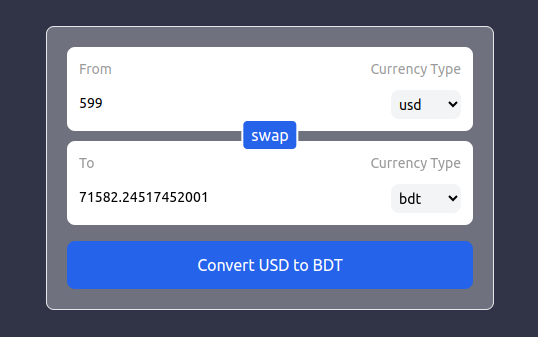
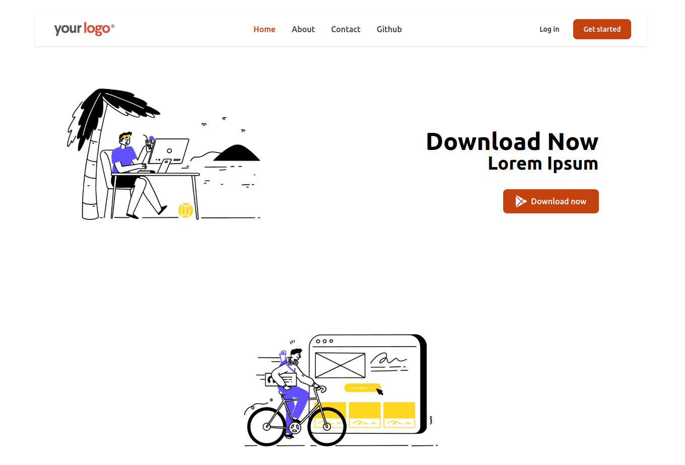
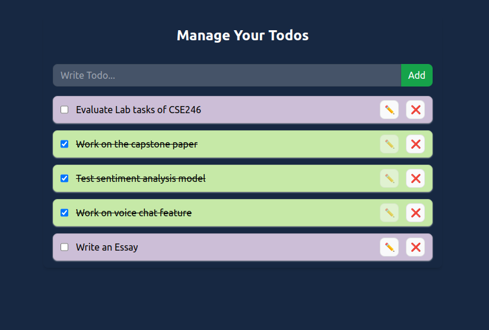

# React Learning Journey

This repo documented all the project that has been done through this journey.

## Project 1: Counter

This counter has been done to practice the concept of `useState` hook.  

## Project 2: Background Changer

This project was created to practice integrating Tailwind CSS for styling and utilizing the `useState` hook for managing state in a React application.
 

## Project 3: Password Generator

This is a password generator project created to practice the `useEffect` and `useCallback` hooks in React. The `useEffect` hook is used to handle side effects, such as updating the UI or managing state changes when dependencies change. The `useCallback` hook is used to memoize the function, improving performance by preventing unnecessary re-creation of function references on every render.

 

## Project 4: Real Time Currency Convertor (Using API)

This project was created to practice custom hooks along with the `useEffect` and `useState` hooks. It includes basic API handling to fetch real-time currency exchange rates, which was managed using the `fetch` API inside a `useEffect` hook.
 

## Project 5: React Router

This project was created to practice using React Router, focusing on features like `Outlet` and `Link` from the `react-router-dom` library.
 

## Project 6: Theme Switcher (Context API)

This project was built to practice the Context API by implementing a theme-switching mechanism. The `useContext` hook was used to access context values, while `useState` managed the theme state. Additionally, `useEffect` was utilized to apply and update the theme mode dynamically.
 

## Project 7: TODO app (Context API)

This project was built to practice the Context API by implementing a fully functional TODO application. A `TodoContext` was created to manage the state and provide methods such as `addTodo`, `updateTodo`, `deleteTodo`, and `toggleComplete`. A custom hook, `useTodo`, was implemented for accessing the context easily within components. The `useState` and `useEffect` hooks were used to manage and synchronize todos with the browser's local storage for persistent data storage.

